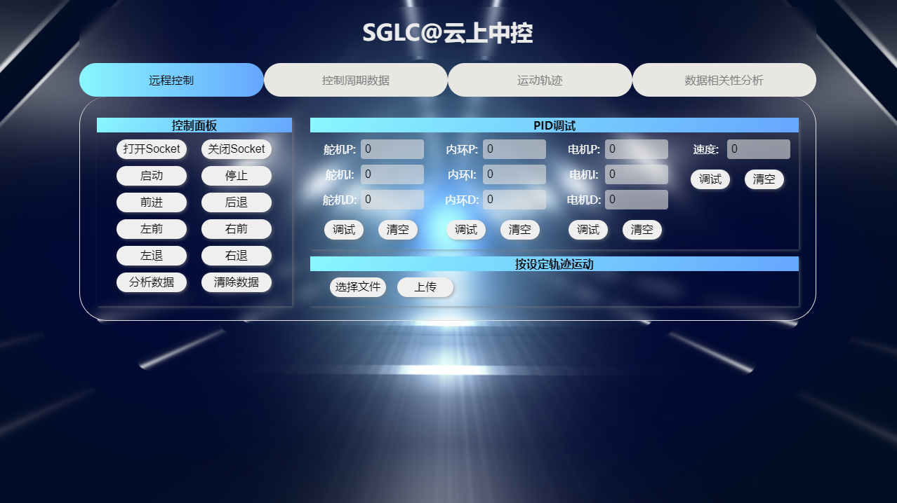
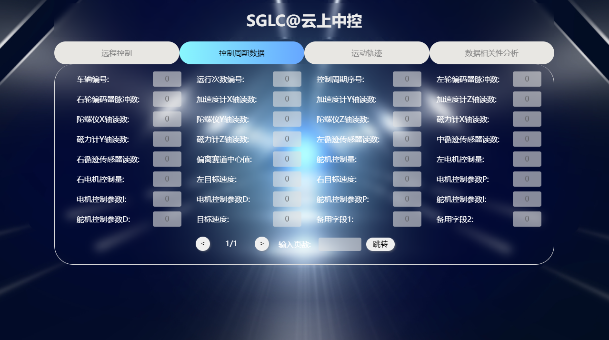
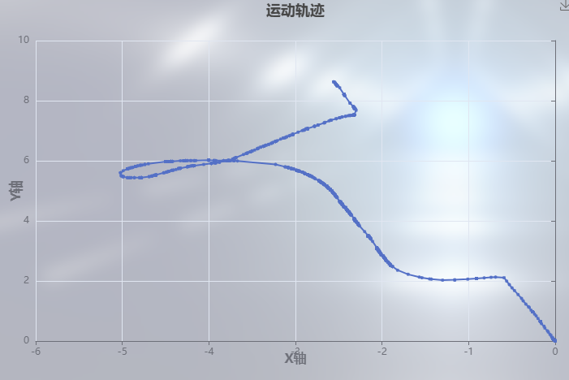
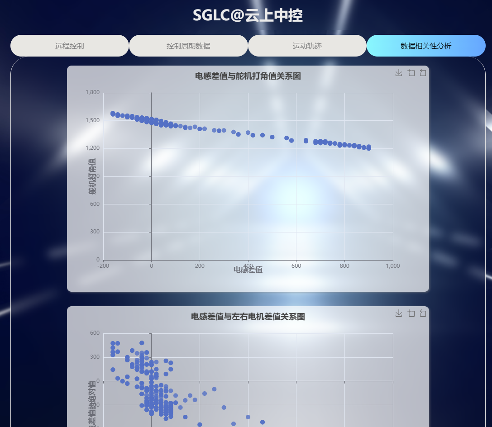

# Web 控制中心
> by SGLC@LusterDawn in 2023-9-5  
> contact me on 381235663@qq.com

## 前言 Introdution
这是我在大学期间的一个课程设计项目，往届的师兄为该项目提供了一个demo项目，但是该项目存在不少的问题，不能很好地发挥示例的作用，甚至会影响学生对技术的热情
。出于对新技术的好奇，我尝试重构这个demo，修复了若干的bug，优化了一系列的逻辑，最终形成了本项目。  

我本人主要从事嵌入式驱动开发，这个项目也是我的首个Web全栈开发项目，如果有不成熟的代码或设计，欢迎指正，如果可以的话，提出一些 issue。

由于时间关系，该重构的项目还是有不少的遗憾，比如：demo中的index.html存在命名不规范的问题，但需要花费不少时间去重构，所以最后还是保持原样。

## 特性 Features
- 直接在浏览器上连接、查看和控制你的数据源！
- 支持 Socket 连接
- [未实现]控制周期数据页面支持动态刷新（目前依靠页面切换来实现半自动更新）
- [未实现]自定义数据协议，适配多种数据源(目前仅适配了智能小车这唯一的场景)
- [未实现]支持串行接口连接
- [未实现]实时更新的数据大屏，多种样式可选
- [未实现]国际化支持
- [未实现]Docker 一键部署支持

Web 控制中心的首页为远程控制，包括控制面板、PID调试、按设定轨迹运动

Web 控制中心的控制周期数据页面展示的是：一系列状态变量的数值

Web 控制中心的运动轨迹界面展示的是：数据发送者的运动轨迹

Web 控制中心的数据相关性分析界面展示的是：数据发送者内部数据之间的关联


## 部署 Deployment
### 前期准备
1. 基础知识要求
   - 计算机组成原理常识
   - 计算机网络常识
   - Linux或者Windows运维经验
2. 硬件要求
   - 核心数不少于4个、内存不少于8G的电脑 A 一台，安装Windows10/11
   - （可选）核心数不少于1个、内存不少于2G的 x86 云服务器 B 一台，操作系统不限
   - （可选）可编程、可以接入网络的设备一个
3. 软件要求
   - 在电脑A上安装最新版本的 [IDEA Ultimate](https://www.jetbrains.com/zh-cn/idea/download/)
   - 在电脑A和B上安装 [Java](https://blog.csdn.net/abg21234567890/article/details/121513660)
   - 在电脑A上安装3.8.4版本的 [maven](https://blog.csdn.net/weixin_44080187/article/details/122933194)
   - 在 IDEA 中配置 JAVA路径和 mavan路径
   - 在电脑A上安装最新版的 [Navicat](https://navicat.com.cn/)
   - 在电脑A和B上安装 [MySQL](https://blog.csdn.net/qq_39652397/article/details/124022739)
   - 在电脑A和B上安装 [Redis](https://keafmd.blog.csdn.net/article/details/114632709)

### 应用配置
如果该应用运行在用户的云服务器 B 上，需要如下配置：
1. 在 B 上配置 MySQL 的账号和密码，然后设置为任何 IP 地址均可访问（或者设置为电脑 A 的公网 IP）
2. 修改 application.yml 中 datasource 下的 username 和 password 为 MySQL 的账号和密码
3. 修改 index.html 文件中IP地址为 B 的公网 IP
4. 修改 socketCommunication.java 中的 ipAddress 变量为 B 的私网 IP
5. 修改仿真数据源文件夹>simulatedDataSource.m 中的 IP 为 B 的公网地址
6. 在 A 上打开 IDEA，利用 maven 构建项目，然后把生成jar包放到 B 上
7. 在 A 上利用 Navicat 连接上 B 的 MySQL，新建一个名为 keshe 的数据库，并在该数据库上运行 xiaoche.sql 文件
8. 在 A 上打开 MATLAB，打开 simulatedDataSource.m 文件
9. 在 B 上运行 jar 包：java -jar keshe-0.0.1-SNAPSHOT.jar

如果该应用运行在用户的电脑 A 上，需要如下配置：
1. 在 A 上配置 MySQL 的账号和密码，并运行
2. 修改 application.yml 中 datasource 下的 username 和 password 为 MySQL 的账号和密码
3. 修改 index.html 文件中IP地址为 127.0.0.1:8001
4. 修改 socketCommunication.java 中的 ipAddress 变量为 127.0.0.1（端口默认为28003）
5. 修改仿真数据源文件夹>simulatedDataSource.m 中的 IP 为 127.0.0.1（端口默认为28003）
6. 在 A 上打开 IDEA，利用 maven 构建项目，获得 jar 包
7. 在 A 上利用 Navicat 连接上本地的MySQL，新建一个名为 keshe 的数据库，并在该数据库上运行 xiaoche.sql 文件
8. 在 A 上打开 MATLAB，打开 simulatedDataSource.m 文件
9. 在 A 上运行 jar 包：java -jar keshe-0.0.1-SNAPSHOT.jar

## 使用 Usage
如果该应用运行在用户的云服务器 B 上，需要如下配置：
1. 在任意设备打开浏览器，在地址栏输入 B 的公网 IP:8001（默认值）即可访问 Web控制中心
2. 在Web控制中心的远程控制页面点击`打开Socket`,即可开启 Socket 服务端，等待数据源的接入
3. 在 A 的 MATLAB 上运行 simulatedDataSource.m 文件，成功连接后 MATLAB 会输出相应日志，Web控制中心会弹出打开成功提示
4. 在Web控制中心的远程控制页面点击`启动`，页面会自动跳转到运动轨迹页面，开始绘制轨迹
5. 在Web控制中心的远程控制页面点击`停止`，轨迹图表、数据相关性图表就会暂停更新，但控制周期数据保持更新
6. 在Web控制中心的远程控制页面点击`打开Socket`即可关闭 Socket 连接
7. 在Web控制中心的远程控制页面点击`清除数据`即可将 MySQL、Redis 以及图表中的数据清空（需要用户确认）

如果该应用运行在用户的电脑 A 上，需要如下配置：
1. 在电脑 A 上打开浏览器，在地址栏输入 127.0.0.1:8001（默认值）即可访问 Web控制中心
2. 其他步骤同上

## 调试 Debug
### MATLAB 数据源调试模式
运行 simulatedDataSource.m 文件时，MATLAB 会弹出一个空白的 figure 窗口，在该窗口上键入x终止程序，键入e暂停程序，键入enter继续程序.

### JVM 本地调试
在 A 上的命令行中运行：
```bash
java -agentlib:jdwp=transport=dt_socket,server=y,suspend=n,address=0.0.0.0:8002 -jar keshe-0.0.1-SNAPSHOT.jar
```
将 A 上的 IDEA 调试端口改为 8002（调试地址默认是127.0.0.1），然后点击 debug ，即可进入本地调试模式

### JVM 远程调试
在 B 上的命令行中运行：
```bash
java -agentlib:jdwp=transport=dt_socket,server=y,suspend=n,address=127.0.0.1:8002 -jar keshe-0.0.1-SNAPSHOT.jar
```
在 A 上的 IDEA 新建一个Remote JVM Debug的配置（IP 设置为 B 的公网 IP，端口设置为 8002），然后点击 debug ，即可进入远程调试模式

### 前端调试
利用 Edge 浏览器提供的 DevTools 来调试前端的代码


## 客制化 Customization
To be Continued...